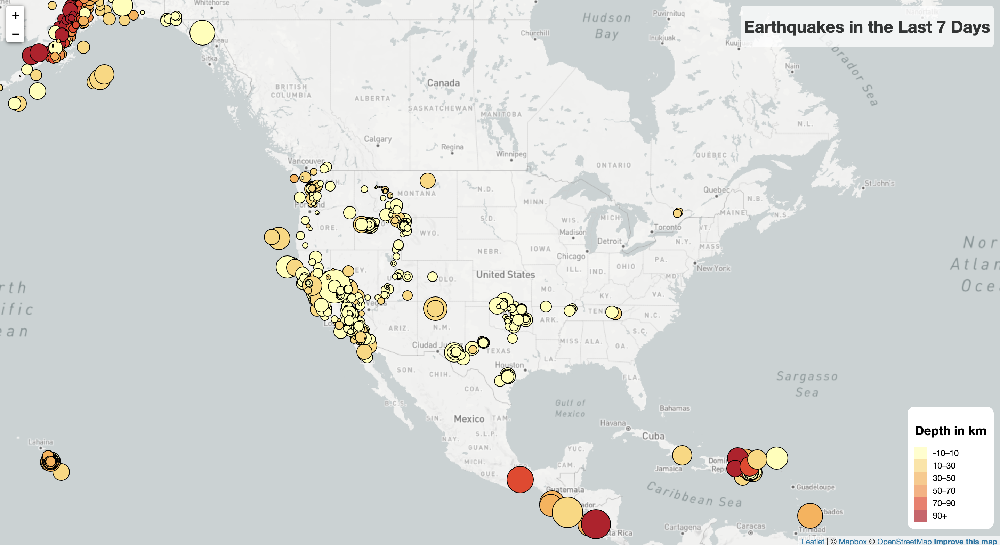
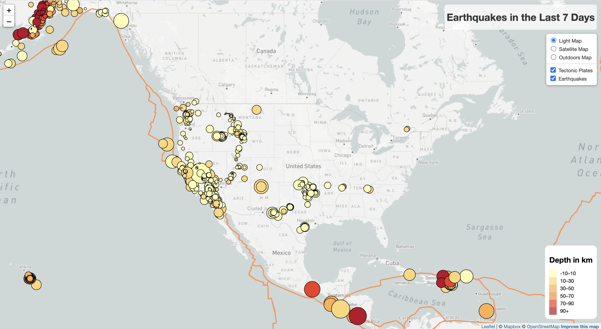

# leaflet-challenge

**View the Live Project Site:** [Earthquake Map](https://juliabrunett.github.io/leaflet-challenge/Leaflet-Step-2/index.html)

***Earthquake Analysis***: This project used Leaflet, d3.js, and Mapbox to create a map from [USGS](https://earthquake.usgs.gov/earthquakes/feed/v1.0/geojson.php) API data on earthquakes in the last 7 days, along with GeoJSON data from a tectonic plates [repo](https://github.com/fraxen/tectonicplates).

**Leaflet Step 1**: This folder contains the first part of the project, where the earthquakes are mapped as circle markers, sized by their magnitude, and colored by their depth. 
- ***static***: ***css*** (styles.css), ***js*** (logic.js: JavaScript to generate the maps), ***images*** (folder containing screenshots of map)
- index.html: base html to hold the map

**Leaflet Step 2**: This folder contains the bonus part of the project, where Step 1 was enhanced by adding multiple base layer options and overlay options (where the user can choose to see the tectonic plates & earthquakes mapped together or individually).
- ***static***: ***css*** (styles.css), ***js*** (logic.js: JavaScript to generate the maps), ***images*** (folder containing screenshots of map), ***data*** (*GeoJSON_tectonic* folder containing the GeoJSON data from the tectonic plates [repo](https://github.com/fraxen/tectonicplates) resource.
- index.html: base html to hold the map

**Note:** Data Source Credit for Tectonic Plates [repo](https://github.com/fraxen/tectonicplates): Hugo Ahlenius, Nordpil and Peter Bird

To run, sign up for a mapbox API key [here](https://www.mapbox.com/).

# Step 1 Map

# Step 2 Map

